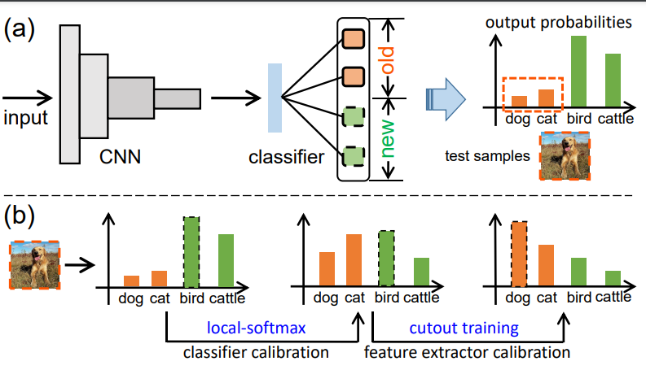

## calibrateCIL - Official PyTorch Implementation

### [ICME2021 Oral] Calibration for Non-exemplar Based Class-incremental Learning
Fei Zhu, Xu-Yao Zhang, Cheng-Lin Liu<br>
[Paper](https://ieeexplore.ieee.org/stamp/stamp.jsp?tp=&arnumber=9428409)
### Usage 
run `main.py`.

## Citation 
```
@inproceedings{zhu2021calibration,
  title={Calibration for Non-Exemplar Based Class-Incremental Learning},
  author={Zhu, Fei and Zhang, Xu-Yao and Liu, Cheng-Lin},
  booktitle={2021 IEEE International Conference on Multimedia and Expo (ICME)},
  pages={1--6},
  year={2021},
  organization={IEEE}
}
```

## Reference
Our implementation uses the source code from the following repository:
* <https://github.com/DRSAD/iCaRL>
